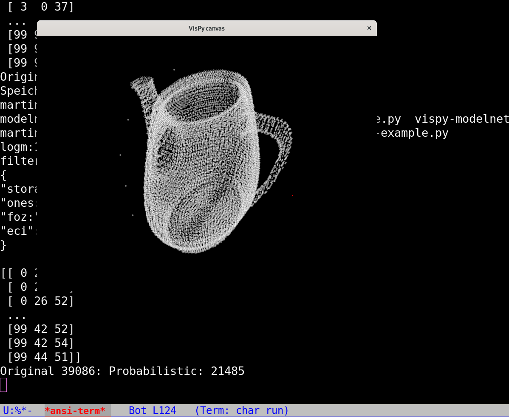

# GloBiMaps3D - A Randomized Data Structure for Globally Sparse Point Cloud Representation

We are happy to announce that our latest research on a randomized data structure GloBiMap3D
for high-resolution, low-cardinality global point cloud which has been published at the 3DGeoInfo
conference in 2022.

The following images illustrate the power of the approach by showing how it works on the teapot model.




Note that we have an error correction methodology in the paper allowing you to have an exact representation!


# Building and Installing
```
$ python3 setup.py bdist_wheel
$ pip3 install dist/*
```

# Resources

tba


